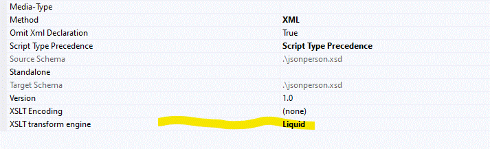
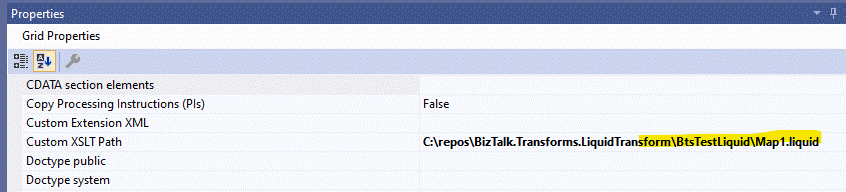

# BizTalk.Transforms.LiquidTransform

Liquid transform engine for BizTalk

### Reference

https://docs.microsoft.com/en-us/biztalk/core/technical-reference/xslt-custom-transform-implementation

JSON content if becoming more and more the standard format. Unfortunally BizTalk uses XML internaly, forcing BizTalk developers to constantly transform between JSON and XML.

With Biztalk 2020 its now possible to create/add custom transform engines, making it possible to add a liquid transform that makes it possible to transform JSON.

This component uses DotLiquid that enables transform of any format. That is because DotLiquid does not really process JSON or XMl or any other files, it just processes objects.
That means before one can use DotLiquid one needs to to serialize JSON or XML to a object.
At the moment the component transforms all JSON and XML content to anonymous objects.

Transformation works both on Receive and Send ports and also when mapping in Orchestrations.

### Installation

1. Add the binary BizTalk.Transforms.LiquidTransform to the BizTalk folder ..\Microsoft BizTalk Server\Transform Components.
2. GAC both BizTalk.Transforms.LiquidTransform.dll and DotLiquid.dll.
3. Add below XML snippet to the CustomTransform.xml file in the BizTalk folder ..Microsoft BizTalk Server\Developer Tools.

```xml
<Transform 
    DisplayName="Liquid"
    TypeAssemblyQualifiedName="BizTalk.Transforms.LiquidTransform.LiquidTransform, BizTalk.Transforms.LiquidTransform, Version=1.0.0.0, Culture=neutral, PublicKeyToken=969e815b781bd674"/>
```

After you have followed above instructions and restarted Visual studio you should now see the new Liquid transform when opening BizTalk map properties.



### Usage

You will need to use a dummy schema for JSON messages, but be aware that the messagetype will be used in runtime so give it a meningful namespace and root name.

Use a custom .liquid file and add it to the BizTalk maps Custom XSLT property



You should now be able to test the map and get a valid output. Make sure not to validate JSON input/output.


